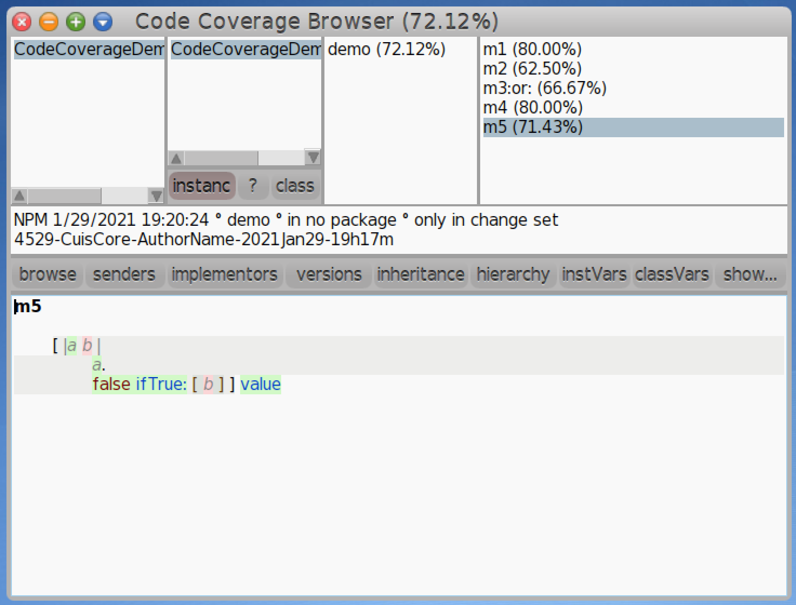

# Code Coverage for Cuis Smalltalk


## Description
`Code Coverage` is a code coverage tool for [Cuis Smalltalk](https://github.com/Cuis-Smalltalk/Cuis-Smalltalk-Dev).

It analyzes the code coverage of any Smalltalk expression, not only test runs.

## Features
_(many more to come)_

### Code Coverage Browser
Easily find which collaborations were not executed using the Code Coverage Browser.  
Get detailed coverage information at the System Category, Class, Message Category or Message level:


### Collaborators coverage
Collaborators are covered when they were used at least once:


Temporary variables declarations are covered when they were either read or written at least once:


Block collaborators are covered when they were used at least once:


Block temporary variables declarations are covered when they were either read or written at least once:


### Boolean coverage
With Boolean Coverage you can easily spot arguments, variables or message sends that only referenced `true` or `false`
(considered 50% covered), or both (considered 100% covered). 

Temporary variables are covered as boolean when they were only assigned to true or false:


The same works for instance variables:


And class variables:


Block variables are supported as well:


Boolean highlighting is also available for message arguments:


And block arguments:


It even supports arbitrary messages that return boolean objects:


## Installing

1. Make sure you have the latest updates installed: `World menu > Changes > Install New Updates`.
The minimum image version required is [Cuis 4527 image](https://github.com/Cuis-Smalltalk/Cuis-Smalltalk-Dev/blob/master/CoreUpdates/4527-CuisCore-NicolasPapagnaMaldonado-2021Jan20-17h23m-NPM.001.cs.st),
where a tiny bug in `BacktickNode` was fixed that prevented `Code Coverage` from analyzing code coverage correctly.
2. Install the `CodeCoverage.pck.st` package in this repository by dragging and dropping it into your Cuis image, and you'll be good to go.

## Usage Instructions
### Using Code Coverage from the UI
When running tests with code coverage from the UI, `Code Coverage` will automatically detect the compiled methods that 
should be analyzed based on the user selection.

There are two ways to automatically detect the compiled methods that should be analyzed.
In any of the following options, a `Code Coverage Browser` will be open displaying code coverage results after running 
the selected item's selected tests.

#### Analyzing coverage of Code Packages
Using the `run package tests with coverage` contextual menu option on a system category will run all tests in the
package, analyzing the coverage of all of its compiled methods (including extensions) that do not belong to a
`TestCase`.

### Analyzing coverage of System Categories, Classes, Message Categories and Messages
Using the `run tests with coverage` contextual menu option in System Categories, Classes, Message Categories, and Messages
will run all tests in the scope of the user selection, analyzing compiled methods as follows.

First, `Code Coverage` will find the root system category of the selected element.
The root system category is the first token (using `-` as the separator) in the system category of the selected element.

> e.g. the root system category of a system category named `Foo-Bar-Baz` is `Foo`.

Once the root system category has been determined, all compiled methods that do not belong to a `TestsCase` defined in 
any system category starting with the root category will be analyzed.

> e.g. given the following system categories:
> * Foo
> * Foo-Bar-Model
> * Foo-Baz
> 
> when using `run tests with code coverage` on the `Foo-Bar-Baz` system category, all the tests under `Foo-Bar-Baz` will
> be run, and the complied methods that do not belong to a `TestCase` in `Foo`, `Foo-Bar-Model`, and `Foo-Baz` will be
> analyzed.

### Analyzing code coverage programmatically
`Code Coverage` can be used programmatically to analyze the code coverage of any code execution.

#### Synchronous Usage
The following example shows how to analyze the code coverage of a collection of compiled methods while a block is
running:

```
compiledMethodsToAnalyze := "a collection of compiled methods to be analyzed"

report := CodeCoverageAnalyzer
    value: [ "here goes the code to be analyzed" ]
    analyzingAll: compiledMethodsToAnalyze
```

#### Asynchronous Usage
`Code Coverage` can also be started and stopped on demand. This could be useful, for instance, when trying to determine the code coverage of compiled methods that are exercised by a UI (e.g. "what gets covered when a button is clicked").

```
compiledMethodsToAnalyze := "a collection of compiled methods to be analyzed"
analyzer := CodeCoverageAnalyzer toAnalyzeAll: compiledMethodsToAnalyze.

analyzer startTrackingCodeCoverage.
"exercise the UI manually"
analyzer stopTrackingCodeCoverage.

report := analyzer report.
```

## How Does It Work?
In a nutshell, `Code Coverage` will wrap the compiled methods to analyze and, on their first usage, will recompile them
adding additional message sends that communicates that the previous statement was covered. Once the coverage analysis is finished,
the wrapped methods are restored to their original versions.

The main concept in  `Code Coverage` are:
* `CodeCoverageAnalyzer` given a collection of compiled methods to analyze, .
* `CompiledMethodCoverageAnalyzer` is the wrapper that takes place of a complied method to analyze. Its main role is to
collect code coverage of the wrapped method while the code coverage analysis is running.
* `CodeCoverageSourceCodeGenerator` is used by `CompiledMethodCoverageAnalyzer` to generate the source code of the wrapped
compiled method that has the message sends that notifies statements were covered when executed.
* `CodeCoverageAnalyzerReport` holds the results of the code coverage analysis, giving access to system categories, classes,
message categories, and messages stats.

The source code is well documented, and together with the automated tests, are a great way to understand how the system 
works.

## Warnings
For the moment `Code Coverage` cannot analyze the classes used to implement it (either the ones in the `CodeCoverage`
package or others like `Set`).

Attempting to run coverage on those classes will have unexpected results, like image hangs or VM crashes.

If you want to have some fun you can try it, but for the moment is it not recommended.

## Feedback 
`Code Coverage` is in its early stages, make sure to send your feedback!

Feel free to [submit an issue](https://github.com/npapagna/cuis-code-coverage/issues) to report bugs, improvements, etc.

Make sure to get in touch if you have any questions about the design, how to make changes, or if you have feature requests.


## Contributing

Take a look at the [the Roadmap dashboard](https://github.com/npapagna/cuis-code-coverage/projects/1) to see if what 
you are trying to do is not already detected or documented. 

Please keep the coding and test styles, and don't hesitate to get in touch if you need any help!
